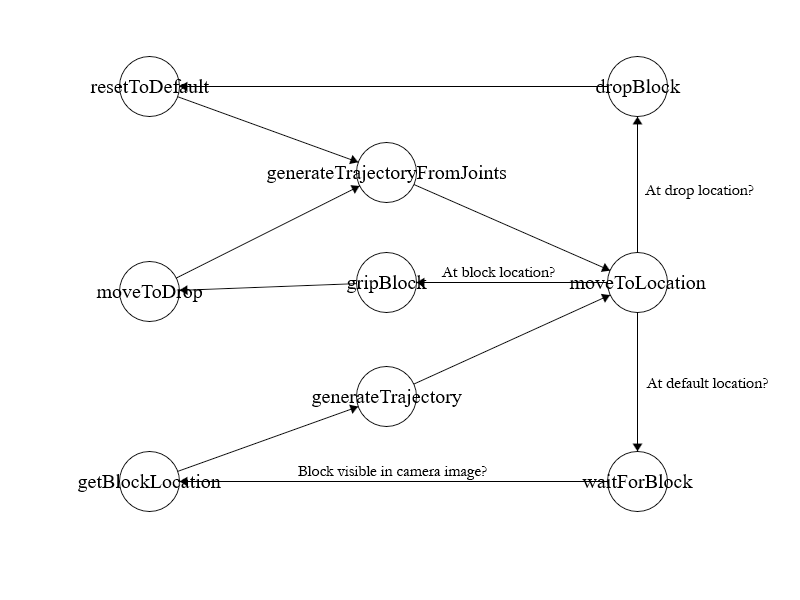

# Technical Approach

This project is organized as a Finite State Machine with states for determining positions to move towards, generating and iterating through a trajectory, and grabbing and dropping blocks.  The FSM states are defined as shown in the figure below, starting with `resetToDefault`:

The finite state machine makes use of the following core pillars:

- Perception
- Kinematics
- Planning/Trajectory generation

The cornerstone of this project is classical perception.  When the controller searches for objects in the camera image, thresholding and contours are used to determine the object centroids from the camera’s perspective.

Forward kinematics is used to determine the location of a detected object based on its pixel location in the camera image.  Inverse kinematics, implemented using the Newton-Raphson algorithm, is used extensively to determine the next joint positions to move towards.

A cubic trajectory generation algorithm is used to ensure smooth and quick motion between two task-space points through configuration-space interpolations. 

 

# Implementation Details

## Environment Setup

The environment is implemented as a simulation in Webots based on its sample factory world.  The base modified factory world and every experimental trial world are in this repository under `worlds/` and can be replayed.

I placed a UR5e robot arm with an attached camera and *robotiq_2f85* gripper onto a table, then placed a conveyor belt to the right of the UR5e for it to drop blocks onto and a conveyor belt going past the front of the UR5e for it to pick blocks up from.  Both conveyor belts have a speed of `0.05 m/s`.

Blocks are implemented as solids with a Box geometry and a material with a `diffuseColor` of `(0.8, 0.8, 0.8)`, a `shininess` of `0.2`, a `specularColor` of `(0, 0, 0)`, a `transparency` of `0`, an `ambientIntensity` of `0.2`, and one of many `emissiveColor` values depending on the color of the block.

The camera has a `fieldOfView` of `1.05`, a `width` of `640`, a `height` of `480`, a `planar` projection type, and `near` and `far` frustums of `0.01` and `3`.

## System Design

All controller code exists in the repository under `controllers/sorting_robot/`.  The controller entrypoint is `sorting_robot.py`.

The finite state machine, defined in `helper.fsm_controller.py`, acts as the main processing unit for the UR5e, and is called from the main controller in `sorting_robot.py` at each timestep to run one of its states:

### Location-Setting States

**`resetToDefault:`** Set the desired joints directly to the set of joint angles to position the camera above the belt at a sufficient height to see the entire width of the belt.  The joint angle set used is generated from a desired pose in task space on the initial run.  Using preset joint angles rather than running the inverse kinematics algorithm on each call to this state is done both to reduce computation and ensure the joint angles for this position are consistent between runs, as the IK algorithm can at times return an impossible joint angle set depending on the starting position.  Moves to `generateTrajectoryFromJoints`.

**`moveToDrop:`** Set the desired joints directly to the set of joints to position the gripped above the output belt.  The joint set used is generated from a pose above the input belt and manually rotated 90 degrees on the first joint since the inverse kinematics algorithm sometimes has troubles generating a valid joint angle set to reach the output belt since it’s decently far from the position objects are grabbed from.  Moves to `generateTrajectoryFromJoints`.

**`getBlockLocation:`** Given the pixel location of a particular block on the camera, calculates the position of the block in the camera space via an inverse perspective projection transform based on the camera’s width, height, field of view, and height above the belt.  Then, it sets the desired pose to the position of this block accounting for the object’s height, the gripper’s position relative to the camera, and the location the block will be along the belt by the time the gripper moves to it (using the `getLocationAfterMotion()` function).  If it’s impossible to grab the block before it moves out of the gripper’s range, moves to `resetToDefault` to wait for the next block.  Otherwise, moves to `generateTrajectory` to move towards the block.

### Trajectory Generation & Iteration States

**`generateTrajectory:`** Given a desired pose, uses IK to generate the desired joint positions, then sets up the trajectory interpolation variables `t`, `T`, `theta_start`, and `theta_end`.  Moves to `moveToLocation`.

**`generateTrajectoryFromJoints:`** Given a set of desired joint angles, sets up the trajectory interpolation variables as above.  Moves to `moveToLocation`.

**`moveToLocation:`** Given a trajectory interpolation setup from one of the above states, iterates and increments `t` until `t == T`, setting the next set of joint angles to move to for the current timestep by calling the interpolation function with the current timestep in the trajectory `t`, the max timestep `T`, the start angles, and the end angles.  Once `t == T`, moves to `waitForBlock` if at the initial position, `dropBlock` if at the drop position, or `gripBlock` otherwise.

### Other States

**`waitForBlock:`** Call getPixelLocations() helper function until a block’s centroid is returned, then set the next target to the position of the block that is furthest down the belt.  Move to `generateTrajectory`.

**`gripBlock:`** Set the gripper flag to closed.  Wait for a preset number of timesteps before moving to `moveToDrop`.

**`dropBlock:`** Set the gripper flag to open.  Wait for a preset number of timesteps before moving to `resetToDefault`.

### Helper Functions

In addition to the states detailed above, the following helper function is used:

**`getPixelLocations():`** Given the current camera image and the set of accepted colors, the function finds all objects that match those colors and returns their center pixel coordinates within the camera image.  For each accepted color, the algorithm thresholds each channel of the image against each channel of the color, merges the three channel thresholds, converts the resulting binary image into contours, then uses the moments of each contour to find the centroid of the object represented by the contour.  If a contour touches the edges of the image, it’s discarded since the object may continue beyond the image and the centroid won’t be accurate.  Finally, the function returns every centroid it found across all accepted colors.

### Trajectory Generation

These functions, defined in `helper.trajectory_generator.py`, are called by the FSM:

**`getRequiredTime():`** Given the start and end joint angles, a preset maximum acceleration and a preset maximum velocity, returns the maximum time any joint will take to interpolate between its start and end angles when speed and acceleration are limited to the maximum values, rounded up to the nearest timestep.

**`getPosition():`** Given the start and end joint angles, the current trajectory timestep t, and the maximum trajectory timestep T, returns the interpolated joint angles at point t along the trajectory.

### Kinematics

These functions, defined in `helper.inverse_kinematics.py`, are called by the FSM:

**`getInverseKinematics():`** Given a desired pose in task space and the current joint angles in configuration space, returns a set of joint angles that will place the end effector at the desired pose.  Uses an implementation of the Newton-Raphson algorithm.

**`getFK():`** Given a set of joint angles, returns the end effector pose.